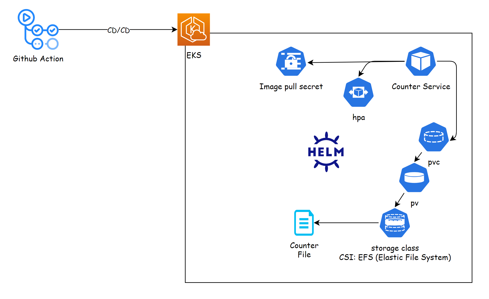
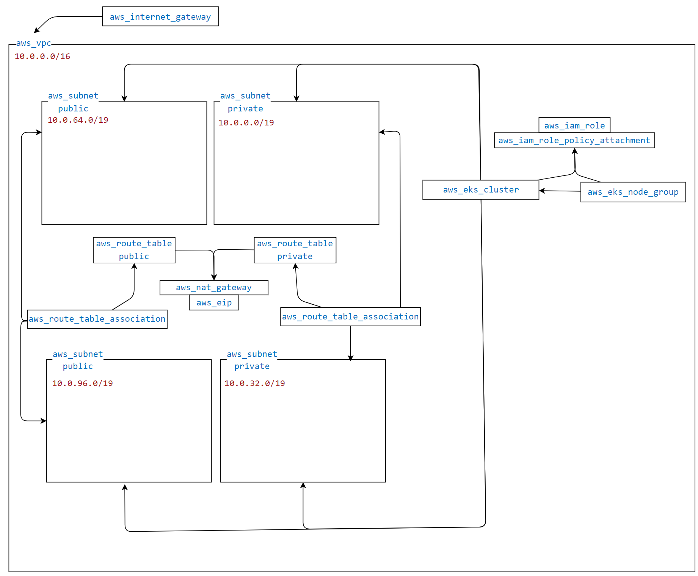

# counter-service
This is a simple web server which counts the amount of POST requests it served, and return it on every GET request it gets


## Assignment requirements:
Your mission, should you choose to accept it, is the development and deployment of a Nano service.

Please read the following instructions before starting to implement your mission, you don't want to miss any important instruction, especially those in General Guidelines, please let me know if you have any questions by Email/Phone/Whatsapp.


Ill provide you an AWS account.

* Env
Install Kubernetes - Have a minimal Kubernetes deployed as code (terraform preferred) in the cloud account.

* Python service
Fork the following repo https://github.com/shainberg/counter-service

This repo contains a simple web page that counts the number of POST requests it served, and returns the counter on every GET request it gets.

Bonus: You can improve the code if you would like to.


* Docker
Create a Docker file for the counter-service, and publish it to Docker registry. Make sure your Docker image is slim.

Bonus: Consider what will happen if the image is restarted? If the counter is persistent you get a bonus


* Deployment
Using a CI/CD service - Create a CI Pipeline for the service it should build the image and upload it to image repo. The Pipeline should be as code.

CD - Upon commit & push to the main (aka master) branch, code should pass CI/CD and be deployed on the "prod" ns. for example: changing something on the git, commit & push, the get web page should change.

Bonus: Have HA for the micro service, and make sure it can scale out


* General Guidelines
Spend some time on designing your solution.
Think about operational use cases from the real world. What happens if a service crashes?
What happens when this service needs to scale? How will it be done?


Deliverables
The url to your "counter-service", on port 80.
Send to me an SCM Merge / pull Request for code review - from your branch to master, containing all of the code for this exercise. The Merge-Request should contain a short description of your changes, and any other comment you’d like us to know of.

---

### Action Items


* Provisioning Infrastructure 
    - [x] Create EKS using Terraform
    - [x] Test cluster acess
    - [x] Nginx ingress Contoller
 
* Counter Service
    - [x] Improve code
    - [x] Dockerise
    - [] Wratp with Helm
    - [ ] Local Deploymetn test 

* CI/CD infra
    - [ ] CI - Continer build & publish
    - [ ] CD - Deploy to via Helm to EKS 


---

<br/>
<br/>
<br/>


Deployment Architecture :



<br/>
<br/>
<br/>

Terraform Architecture



---


---
### Export kubeconifg
```bash
aws eks update-kubeconfig --region eu-west-2 --name infinity
```
--


### EKS Persistent storage for Maintaining County State 


EFS
```bash
~ on ☁️  (eu-west-2) took 4s
❯ aws efs describe-file-systems --query "FileSystems[*].[FileSystemId,Name,CreationTime,NumberOfMountTargets]" --output table
--------------------------------------------------------------------
|                        DescribeFileSystems                       |
+-----------------------+-------+-----------------------------+----+
|  fs-04c766103518e0935 |  None |  2024-11-15T00:42:33+02:00  |  2 |
+-----------------------+-------+-----------------------------+----+

~ on ☁️  (eu-west-2) took 6s
❯
```

Install EFS CSI Driver :
```
helm upgrade --install aws-efs-csi-driver --namespace kube-system aws-efs-csi-driver/aws-efs-csi-driver
```


SC,PV,PVC
```yaml
apiVersion: storage.k8s.io/v1
kind: StorageClass
metadata:
  name: efs-sc
provisioner: efs.csi.aws.comapiVersion: v1

---

kind: PersistentVolume
metadata:
  name: efs-pv
spec:
  capacity:
    storage: 5Gi
  volumeMode: Filesystem
  accessModes:
    - ReadWriteOnce
  storageClassName: efs-sc
  persistentVolumeReclaimPolicy: Retain
  csi:
    driver: efs.csi.aws.com
    volumeHandle: fs-04c766103518e0935apiVersion: v1
kind: PersistentVolumeClaim
metadata:
  name: efs-claim
spec:
  accessModes:
    - ReadWriteOnce
  storageClassName: efs-sc
  resources:
    requests:
      storage: 5Gi

---

kind: PersistentVolume
metadata:
  name: efs-pv
spec:
  capacity:
    storage: 5Gi
  volumeMode: Filesystem
  accessModes:
    - ReadWriteOnce
  storageClassName: efs-sc
  persistentVolumeReclaimPolicy: Retain
  csi:
    driver: efs.csi.aws.com
    volumeHandle: fs-04c766103518e0935apiVersion: v1


kind: PersistentVolumeClaim
metadata:
  name: efs-claim
spec:
  accessModes:
    - ReadWriteOnce
  storageClassName: efs-sc
  resources:
    requests:
      storage: 5Gi
```


```bash
❯ k get sc,pv,pvc
NAME                                 PROVISIONER             RECLAIMPOLICY   VOLUMEBINDINGMODE      ALLOWVOLUMEEXPANSION   AGE
storageclass.storage.k8s.io/efs-sc   efs.csi.aws.com         Delete          Immediate              false                  14m
storageclass.storage.k8s.io/gp2      kubernetes.io/aws-ebs   Delete          WaitForFirstConsumer   false                  29m

NAME                      CAPACITY   ACCESS MODES   RECLAIM POLICY   STATUS   CLAIM               STORAGECLASS   VOLUMEATTRIBUTESCLASS   REASON   AGE
persistentvolume/efs-pv   5Gi        RWO            Retain           Bound    default/efs-claim   efs-sc         <unset>                          14m

NAME                              STATUS   VOLUME   CAPACITY   ACCESS MODES   STORAGECLASS   VOLUMEATTRIBUTESCLASS   AGE
persistentvolumeclaim/efs-claim   Bound    efs-pv   5Gi        RWO            efs-sc         <unset>                 14m
```


Test :

```yaml
kind: Pod
metadata:
  name: efs-app
spec:
  containers:
  - name: app
    image: centos
    command: ["/bin/sh"]
    args: ["-c", "while true; do echo $(date -u) >> /data/out.txt; sleep 5; done"]
    volumeMounts:
    - name: persistent-storage
      mountPath: /data
  volumes:
  - name: persistent-storage
    persistentVolumeClaim:
      claimName: efs-claimapiVersion: v1
```


```bash
counter-service/cluster-provisioning/terraform on  dev [✘!?] via 💠 default on ☁️  (eu-west-2) 
❯ kubectl exec -ti efs-app -- tail -f /data/out.txt
Thu Nov 14 23:20:18 UTC 2024
Thu Nov 14 23:20:23 UTC 2024
Thu Nov 14 23:20:28 UTC 2024
Thu Nov 14 23:20:33 UTC 2024
Thu Nov 14 23:20:38 UTC 2024
Thu Nov 14 23:20:43 UTC 2024
Thu Nov 14 23:20:48 UTC 2024
Thu Nov 14 23:20:53 UTC 2024
Thu Nov 14 23:20:58 UTC 2024
Thu Nov 14 23:21:03 UTC 2024
Thu Nov 14 23:21:08 UTC 2024
```

--

### Addressing General Guidelines

* operational use cases from the real, service crashes
    - Configure Kubernetes to automatically restart a failed service
    - Liveness and Readiness probes
        - Livens:
            1. Check http service is up and runnig by sending GET req to getll endpoints
            2. Validate the "cash" file mount from pv. Check the counter value >= 0.
        - Readiness
            1. Use http prob declerative to check reponse for the main get counter value endpoint to be 200 ok.
    - Rollback : canary deployment or blue-green deployment
    - Crash Analysis and Monitoring :  P -1
    - Resource Management and Scaling
        - Resource Limit 
        - HPA
        - Scale cluster compute : Cluster Autoscaler


