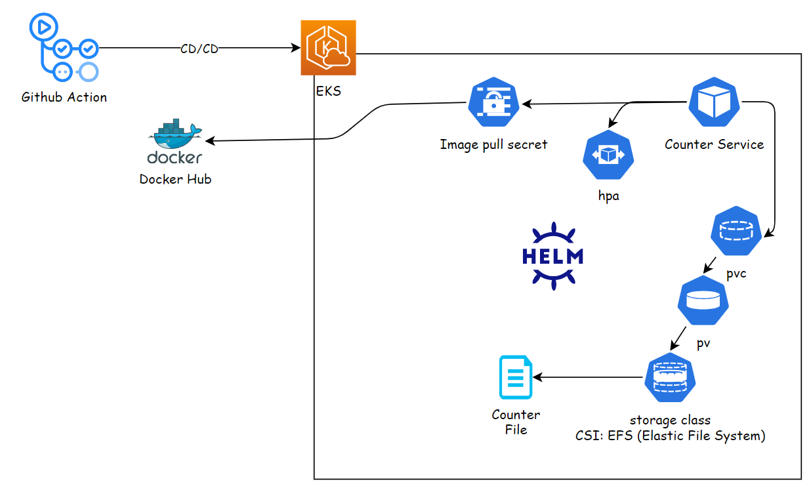
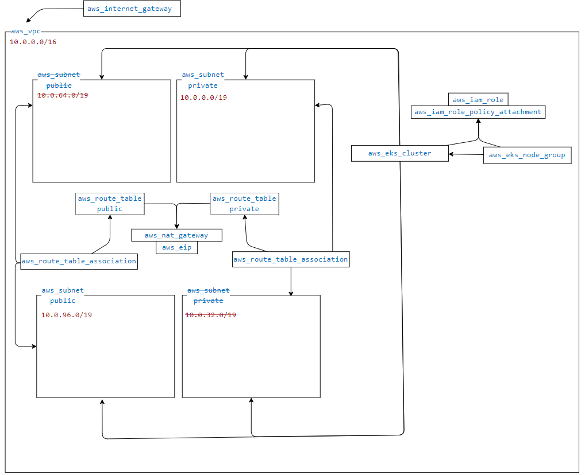

# counter-service
This is a simple web server which counts the amount of POST requests it served, and return it on every GET request it gets


## Assignment requirements:
Your mission, should you choose to accept it, is the development and deployment of a Nano service.

Please read the following instructions before starting to implement your mission, you don't want to miss any important instruction, especially those in General Guidelines, please let me know if you have any questions by Email/Phone/Whatsapp.


Ill provide you an AWS account.

* Env
Install Kubernetes - Have a minimal Kubernetes deployed as code (terraform preferred) in the cloud account.

* Python service
Fork the following repo https://github.com/shainberg/counter-service

This repo contains a simple web page that counts the number of POST requests it served, and returns the counter on every GET request it gets.

Bonus: You can improve the code if you would like to.


* Docker
Create a Docker file for the counter-service, and publish it to Docker registry. Make sure your Docker image is slim.

Bonus: Consider what will happen if the image is restarted? If the counter is persistent you get a bonus


* Deployment
Using a CI/CD service - Create a CI Pipeline for the service it should build the image and upload it to image repo. The Pipeline should be as code.

CD - Upon commit & push to the main (aka master) branch, code should pass CI/CD and be deployed on the "prod" ns. for example: changing something on the git, commit & push, the get web page should change.

Bonus: Have HA for the micro service, and make sure it can scale out


* General Guidelines
Spend some time on designing your solution.
Think about operational use cases from the real world. What happens if a service crashes?
What happens when this service needs to scale? How will it be done?


Deliverables
The url to your "counter-service", on port 80.
Send to me an SCM Merge / pull Request for code review - from your branch to master, containing all of the code for this exercise. The Merge-Request should contain a short description of your changes, and any other comment you’d like us to know of.

---

Action Items


* Provisioning Infrastructure 
    - [ X ] Create EKS using Terraform
    - [ X ] Test cluster acess
 
* Counter Service
    - [ ] Improve code
    - [ ] Dockerise
    - [ ] Wratp with Helm
    - [ ] Local Deploymetn test 

* CI/CD infra
    - [ ] CI - Continer build & publish
    - [ ] CD - Deploy to via Helm to EKS 


---




<br/>
<br/>
<br/>





---


---
### Export kubeconifg
```bash
aws eks update-kubeconfig --region eu-west-2 --name infinity
```
--


### EKS Persistent storage for Maintaining County State 


View Storage Class 
```yaml
~ on ☁️  (eu-west-2)
❯ aws ec2 describe-volumes --query 'Volumes[*].[VolumeId,Size,State,VolumeType,AvailabilityZone,CreateTime]' --output table
----------------------------------------------------------------------------------------------------
|                                          DescribeVolumes                                         |
+------------------------+-----+---------+------+-------------+------------------------------------+
|  vol-05d5a8bb8ec96c7b1 |  20 |  in-use |  gp3 |  eu-west-2a |  2024-11-14T12:23:23.566000+00:00  |
+------------------------+-----+---------+------+-------------+------------------------------------+

~ on ☁️  (eu-west-2)
❯ k get sc
NAME   PROVISIONER             RECLAIMPOLICY   VOLUMEBINDINGMODE      ALLOWVOLUMEEXPANSION   AGE
gp2    kubernetes.io/aws-ebs   Delete          WaitForFirstConsumer   false                  5h27m

~ on ☁️  (eu-west-2) took 3s
❯ k get sc -o yaml
apiVersion: v1
items:
- apiVersion: storage.k8s.io/v1
  kind: StorageClass
  metadata:
    annotations:
      kubectl.kubernetes.io/last-applied-configuration: |
        {"apiVersion":"storage.k8s.io/v1","kind":"StorageClass","metadata":{"annotations":{},"name":"gp2"},"parameters":{"fsType":"ext4","type":"gp2"},"provisioner":"kubernetes.io/aws-ebs","volumeBindingMode":"WaitForFirstConsumer"}
    creationTimestamp: "2024-11-14T12:20:28Z"
    name: gp2
    resourceVersion: "270"
    uid: 68325613-dbca-42a9-8a1e-fd6945a8aefa
  parameters:
    fsType: ext4
    type: gp2
  provisioner: kubernetes.io/aws-ebs
  reclaimPolicy: Delete
  volumeBindingMode: WaitForFirstConsumer
kind: List
metadata:
  resourceVersion: ""

~ on ☁️  (eu-west-2)
❯
```

PV & PVC 
```yaml
# pv
---
apiVersion: v1
kind: PersistentVolume
metadata:
  name: existing-ebs-pv
spec:
  capacity:
    storage: 20Gi 
  volumeMode: Filesystem
  accessModes:
    - ReadWriteOnce 
  persistentVolumeReclaimPolicy: Retain
  storageClassName: gp2 
  awsElasticBlockStore:
    volumeID: vol-05d5a8bb8ec96c7b1
    fsType: ext4  

---
# pv
apiVersion: v1
kind: PersistentVolumeClaim
metadata:
  name: existing-ebs-pvc
spec:
  accessModes:
    - ReadWriteOnce
  storageClassName: gp2
  resources:
    requests:
      storage: 1Gi 
```


--

### Addressing General Guidelines

* operational use cases from the real, service crashes
    - Configure Kubernetes to automatically restart a failed service
    - Liveness and Readiness probes
        - Livens:
            1. Check http service is up and runnig by sending GET req to getll endpoints
            2. Validate the "cash" file mount from pv. Check the counter value >= 0.
        - Readiness
            1. Use http prob declerative to check reponse for the main get counter value endpoint to be 200 ok.
    - Rollback : canary deployment or blue-green deployment
    - Crash Analysis and Monitoring :  P -1
    - Resource Management and Scaling
        - Resource Limit 
        - HPA
        - Scale cluster compute : Cluster Autoscaler


# 403

```
Plan: 16 to add, 0 to change, 0 to destroy.
module.K8sInfra.aws_eip.nat: Creating...
module.K8sInfra.aws_vpc.main: Creating...
╷
│ Error: Error creating EIP: UnauthorizedOperation: You are not authorized to perform this operation. User: arn:aws:iam::630943284793:user/nadavops@gmail.com is not authorized to perform: ec2:AllocateAddress on resource: arn:aws:ec2:us-east-1:630943284793:elastic-ip/* because no identity-based policy allows the ec2:AllocateAddress action. Encoded authorization failure message: LFKgZ-6vRe92Bt2SLH84UQGBPJUTPs8oDvZyKm2WgGmGi6J0etYeX0NN3pwe5bmPttEzVW7PqAjkUf4_hkL0hG_cAtGjY4iZlSgBm3xprphVUAZtazzUBqib9Dk0Dq9dSxVHDqpYqSIiYdHKPQfEJfoGBwKsLrQEBsEx8392ZbybVs84omnBhO31_EN_kHemwTftyQ_wdcOBZnpJFUm6KfL7keGrl62uuYsrDPfbTvqAWpMAHf9bzvfy9oRmSLyT0Jr8JZIZ_nCjWQFTM4oHj8wS-G_gNONqDDVoQyXD4ZFcdz1gh_bwP4BJmwE7UKhLIWEtbprxDJmk_YSA5GP5yGXg4MfkKlbRcLub0aROthYCXcd-YGVA7e8-xNKrXBYPtUKg3DI3icw3kRo3A2XdSzbsbuBbuaxtBlth_s7K-bGx7kxcJ5BMM9huoEPgL-sVWA4lZ-nRkaMdNbX6Lguq4JQAMaABFZGHNrQMW3BGGRdYf1YSpw_bbKFAQiH9RjCl9cbk45MlrT0hesEUWp6n
│       status code: 403, request id: 51634e8a-0f88-43ed-96e5-be9259d7121b
│ 
│   with module.K8sInfra.aws_eip.nat,
│   on modules/eks/nat.tf line 1, in resource "aws_eip" "nat":
│    1: resource "aws_eip" "nat" {
│ 
╵
╷
│ Error: error creating EC2 VPC: UnauthorizedOperation: You are not authorized to perform this operation. User: arn:aws:iam::630943284793:user/nadavops@gmail.com is not authorized to perform: ec2:CreateVpc on resource: arn:aws:ec2:us-east-1:630943284793:vpc/* because no identity-based policy allows the ec2:CreateVpc action. Encoded authorization failure message: z621hbjSx4hBLBUr3KpJsJZvsZ0HNLeYDQ3n7qJaqR2f0D3YdbE-nwg2o5vDizW54rHpo90lCZ51XzNMpXgem5h_tzuyz4jeagop-_Wm-lOufc0GibIpjJUrMcFdcNjBnGFKU-8rG1VNd2hshBxZJ9KXStL_5wdAdhDWKCTvMYaQvURgEkAbzuP-KLO26cxFl-qvnTF1C9Wp326-PLHD5SSlwTFhxBCHdqL_pt4dl89EumQ_g2ESPTLUIAbopG5hV-SdNnN_YZ7WgQjW3Tx8Apq3h9mzqSYfnrq0z3LYZTbPjhqeRsj_M2bf4SCB6Cr-rJEP9xeu9-bWfQJIrZTXxxA23RKXes4Vd1xOT9s2pM5in25LmZK8z0Sglk7JVyBLF2nPJKPK73hb4N7m1eJUO4wRx_I5VAbZAy13GFU3zKA_BK0fwvHswyHIf1ENSXJh9OGRatBfzJZS2A4u4DoFzLSjC1l2ZjDDcpV7j3UQnD_4aNMTGeUjSIeTQCLeoo9nZYKYzdLiE3T43Hg
│       status code: 403, request id: 96320531-bdae-44c0-8555-f65694b80f32
│ 
│   with module.K8sInfra.aws_vpc.main,
│   on modules/eks/vpc.tf line 1, in resource "aws_vpc" "main":
│    1: resource "aws_vpc" "main" {
│ 
╵

counter-service/cluster-provisioning/terraform on  dev [!?] via 💠 default on ☁️  (us-east-1) took 13s 
❯ 
```


```
module.K8sInfra.aws_vpc.main: Creating...
╷
│ Error: error creating EC2 VPC: UnauthorizedOperation: You are not authorized to perform this operation. User: arn:aws:iam::630943284793:user/nadavops@gmail.com is not authorized to perform: ec2:CreateVpc on resource: arn:aws:ec2:us-east-1:630943284793:vpc/* because no identity-based policy allows the ec2:CreateVpc action. Encoded authorization failure message: aVuwP1GXOf4acc-Y0_PrSv1NR7cDwRzrSux5Ja0zySePvO-sTAYNjhSFz827iXn4R9ZFDoFwy0BNVDKEs9802QEoA7UKXWDfmSVVIYkxZnrqX-NAeNb8FgWupb2nX-75lJ5DYFmgNyXDYYAsk_QKvzavmhOr14cjrkKGm-cGTZuPfYn4b2KhwHpbhdMmqdAllqyaglFlTEguDyiEBbtTTBHKX-rzHLr2N94t63-4Oc4Uk2sUTj993zI3lVKWNlkMiAUGLH6LeYYBKVf0oLl6cZuS2FGossFxpWXqSImp2E7YsDOfZJcJpItJbcnsTeFQXUJYv3u36PDGE6rD3VndmdxVfV1j5Nhk9gzpPw5c8AttiV97KNZ19ug7FRz1i1WhMrMBcFAcg2BvmKQXzC4MSlMh6jpBh0O0QTWxbKQuTWQsi-31f4wgmHMqHIDj2_PDm4lUm_2v1cRO_Z5lwH50TqrZFj9UyO7joFF7mQ7QiE5zXqcEl2jmDA31OVU-JJ4d-kP5BEAb7Q4z9dk
│       status code: 403, request id: 142edc42-9766-492c-a1fb-c23efe6c20e0
│ 
│   with module.K8sInfra.aws_vpc.main,
│   on modules/eks/vpc.tf line 1, in resource "aws_vpc" "main":
│    1: resource "aws_vpc" "main" {
│ 
```


